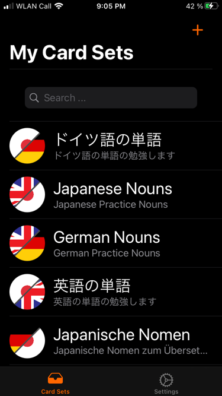
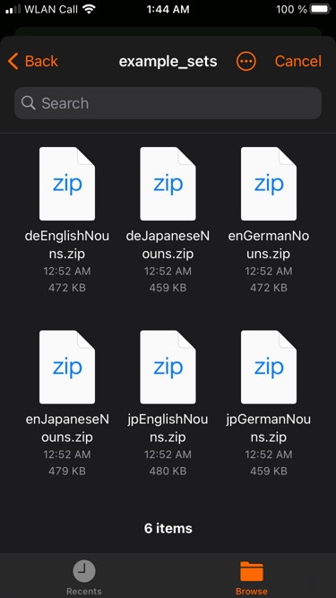

# featherStack

featherStack is a lightweight open source flash card app, allowing for cross-platform development by moving most functionality in a C++ library. This allows your card set to work across platforms while still making use of platform-specific features in the actual
app by relying on the widely available C-Binding mechanism found in languages such as Swift and Objective-C (iOS, macOS),
Kotlin (Android) and C++ (Linux).

## Easy, Content Focused Interface

 

The interface design implemented for featherStack puts the focus right where you want it: Your content.
Button usage is kept to a minimum, and all text and imagery is shown as clearly as possible.
The colors used by backgrounds were chosen to be rather weak, and all accent coloring is meant to give
off a warm and welcoming feeling to the user.

Most navigation and interaction is also handled with gestures, and animations are short to allow for a fast
progression through your content.

## Import From Where You Want

featherStack relies on built in file browsers, which allows the app to conform to your needs instead of the 
other way around. You will not be forced to use a custom propietary service used only by this App. Google 
Drive, iCloud, USB - everything your host platform supports it with it's native file choosing methods is also supported by featherStack. 

All file management is handled by the hosts file management. featherStack's library, libfscore, then takes the action of modifying the context to both add and remove cards. This allows the app to also allign itself with the native directory structure while maintaining file editing capabilities.

## Customization

Keeping it simple was also kept true in terms of the app settings. Keeping the UI design simple usually means that
only some or maybe no options for configuration are available, and the same is also true for featherStack.
The goal was to keep options as simple as possible, and focus on settings which help define the usage of the app.
In this case, that means that 2 areas where focused on:

- Card Interaction
- Search

featherStack allows you to modify your gestures and card picking to your liking, which are the settings most likely to
be changed by users.

## libfscore

The fscore library was designed to allow for easy porting of core functionality. It also handles card loading on a destination 
given, so that you can turn the application to whatever you want it to do while threaded loading handles all work in the 
background.

Another feature is the caching of the library. Memory returned is only deallocated if the cache is full, it will be reused otherwise.
Values of cards are simply overwritten, and in some cases depending on the requested card even reused. This, together with the
threaded loading design should help a lot with both memory usage and loading times.

## F.A.Q

### Where is the documentation?
The documentation for libfscore and featherStack-iOS is split and each documentation
can be found in the root folder of the project.

### What about the card set format?
Card sets are imported as simple .zip files whose files and directories follow a pre-defined
structure. You can view some usable example sets and more information in the "example_sets"
directory.

### Why was the functionality moved to a library?
This approach was chosen for two reasons: To be able to quickly port the basic functionality required while also
allowing for files to be reused and exchanged between platforms. This approach also improves maintanability, since 
updating the basic functionality in a library often only requires a recompilation.

## 3rd Party Components
The featherStack app uses the following third party components:

- Zip by Roy Marmelstein (https://github.com/marmelroy/Zip)
