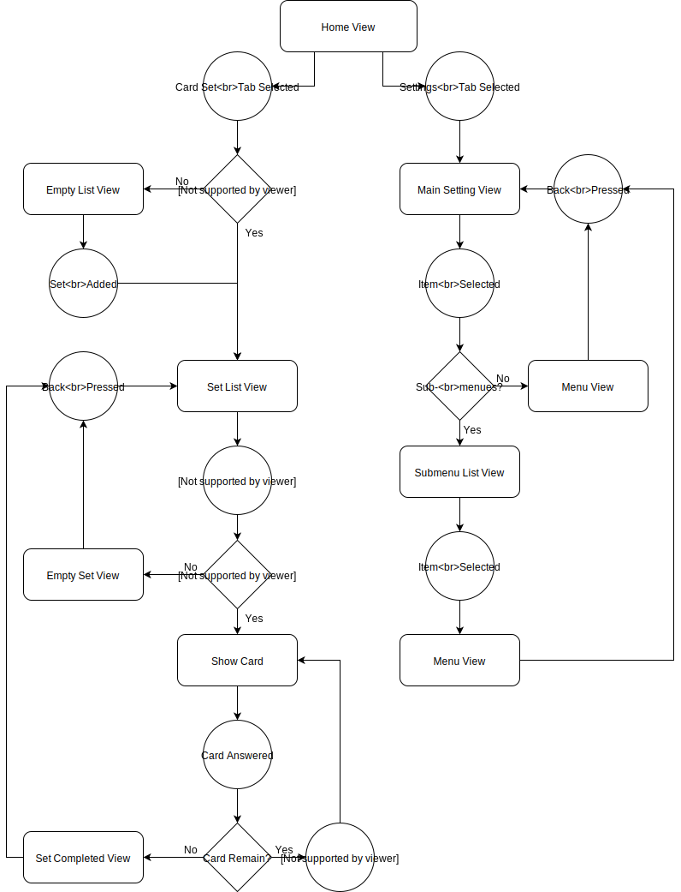
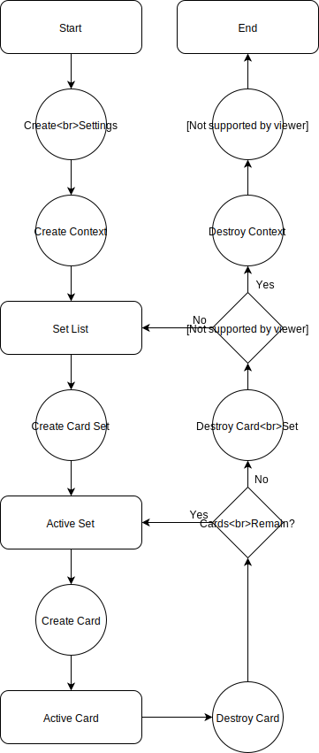

************
Program Flow
************
Shown here is a simplified depiction of both the UI and component flow while 
the app is in use.

UI Flow
-------
The UI flow is kept simple, following simple paths based on the current tab 
viewed by the user. All view navigation is realized using navigation links.

Component Flow
--------------
featherStack-iOS destroys (returns) the content provided by libfscore when the 
model containing them is destroyed. The model destruction happens by 
invalidation of the view model.

A card contains a strong reference to the card set to ensure complete card 
destruction, and each card set contains a strong reference to the context for 
complete destruction.

The components essentially "unwind" the deeper the user goes in the user 
interface, and "wind back up" if the user returns while maintaining proper 
conntections for destruction. 

